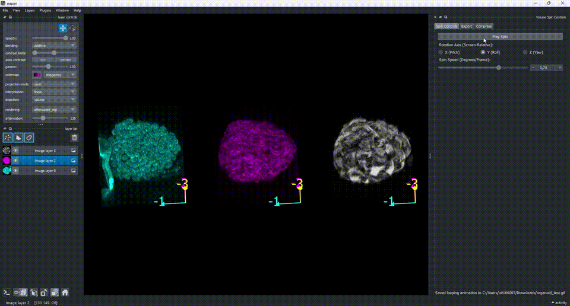

# napari-volume-spin

[](https://github.com/Macl-I/napari-volume-spin/raw/main/LICENSE)
[](https://pypi.org/project/napari-volume-spin)
[](https://python.org)
[](https://github.com/Macl-I/napari-volume-spin/actions)
[](https://codecov.io/gh/Macl-I/napari-volume-spin)
[](https://napari-hub.org/plugins/napari-volume-spin)
[](https://napari.org/stable/plugins/index.html)
[](https://github.com/copier-org/copier)

Imaris-style continuous 3D spin animation controls for napari, with looping GIF/MP4 export

----------------------------------

This [napari] plugin was generated with [copier] using the [napari-plugin-template].

## Demo

<!-- Record a short screen capture of the plugin in action (Spin Controls -> Export -> Compress)
     and save it as docs/demo.gif (or docs/demo.mp4), then this will render on GitHub/PyPI/napari hub. -->


## Features

`napari-volume-spin` adds a **Volume Spin Controls** dock widget with three
tabs that mimics Imaris's continuous 3D rotation animation:

**Spin Controls tab**

- **Play / Pause** a continuous spin of the 3D camera around the currently
  viewed volume.
- Choose the screen-relative rotation **axis**: X (pitch), Y (roll), or Z (yaw).
- Adjust **spin speed** (0.05–1.0 degrees/frame) via a linked slider and spin box.

**Export tab**

- **Export a looping GIF or MP4** of the current axis/speed settings: a full
  360° rotation is captured automatically so the animation loops seamlessly,
  and you are always prompted for the save location.
- **Loop Axis**: for multi-dimensional images (e.g. a time series), pick an
  extra (non-displayed) axis to page through frame-by-frame while the camera
  keeps spinning — the number of captured frames then matches that axis's
  length instead of a fixed 360° rotation, and the FPS field controls
  playback speed of the resulting file.
- A **progress bar** and **Cancel** button are shown while frames are captured;
  the (often slower) file encoding step runs in a background thread so napari
  stays fully interactive.

**Compress tab**

- **Compress Animation...** shrinks an existing GIF/MP4/WebP/MOV/AVI file.
  Choose a compression **scheme** — WebP or MP4 use lossy, per-frame
  (JPEG-like) image compression instead of GIF's 256-color palette, which
  avoids the choppy banding/dithering artifacts a plain palette-based GIF
  produces. Compression automatically tries progressively lower
  scale/quality tiers until the output is under 25 MB (handy for e-mail
  attachments), while never dropping below 24 fps.

## Usage

1. Open napari with a 3D (or higher-dimensional) volume layer and switch to
   3D display (`ndisplay=3`).
2. Open `Plugins > napari-volume-spin: Volume Spin Controls`.
3. On the **Spin Controls** tab, pick a rotation axis and speed, then click
   **Play Spin** to start the continuous animation.
4. Switch to the **Export** tab, choose **GIF** or **MP4**, an FPS, and
   optionally a **Loop Axis** (for multi-dimensional images), then click
   **Export Looping Animation...**. Use **Cancel** to abort mid-capture.
5. If the resulting file is too large (e.g. for e-mail), switch to the
   **Compress** tab, pick a compression scheme, and click **Compress
   Animation...** to save a smaller copy.

## Installation

You can install `napari-volume-spin` via [pip]:

```bash
pip install napari-volume-spin
```

If napari is not already installed, you can install `napari-volume-spin` with napari and Qt via:

```bash
pip install "napari-volume-spin[all]"
```


To install latest development version:

```bash
pip install git+https://github.com/Macl-I/napari-volume-spin.git
```


## Contributing

Contributions are very welcome. Tests can be run with [tox], please ensure
the coverage at least stays the same before you submit a pull request.

## License

Distributed under the terms of the [BSD-3] license,
"napari-volume-spin" is free and open source software

## Issues

If you encounter any problems, please [file an issue] along with a detailed description.

[napari]: https://github.com/napari/napari
[copier]: https://copier.readthedocs.io/en/stable/
[MIT]: http://opensource.org/licenses/MIT
[BSD-3]: http://opensource.org/licenses/BSD-3-Clause
[GNU GPL v3.0]: http://www.gnu.org/licenses/gpl-3.0.txt
[GNU LGPL v3.0]: http://www.gnu.org/licenses/lgpl-3.0.txt
[Apache Software License 2.0]: http://www.apache.org/licenses/LICENSE-2.0
[Mozilla Public License 2.0]: https://www.mozilla.org/media/MPL/2.0/index.txt
[napari-plugin-template]: https://github.com/napari/napari-plugin-template

[file an issue]: https://github.com/Macl-I/napari-volume-spin/issues

[tox]: https://tox.readthedocs.io/en/latest/
[pip]: https://pypi.org/project/pip/
[PyPI]: https://pypi.org/
